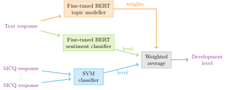

AI and ML implementation
========================
The artificial intelligence (AI)/ML implementation for the CCC comprises two main functionalities:
  * performing audits on the quality of form responses submitted by raters,
  * fitting responses to development levels for each EPA and Key Function (KF).

Fitting responses to EPAs
-------------------------
Custom-trained ML models will be used to fit responses to the development levels for each EPA and
KF. In the form, the devleopment level of each KF will be determined by a combination of one or
more multiple-choice question (MCQ) responses and a free-form text response. The MCQ responses
will be used to determine the initial development level, and the free-form text response will be used
to refine the development level.

The ML models will be trained on a dataset of past form responses and their corresponding devel-
opment levels. The models will be trained using a supervised learning approach, where the input
data is the MCQ responses and free-form text responses, and the output data is the corresponding
development levels.

.. _SVM:

MCQ responses
-------------
The MCQ responses is classified by a **support vector machine** (SVM) model. Each KF has its own
**SVM** model, which is trained on a dataset of form responses and their corresponding development
levels. The responses is encoded as boolean values, where each response is assigned true or false
based on the rater's observed activities by the student.

.. _BERT:

Text responses
--------------
The free-form text response is classified by fine-tuned **Bidirectional Encoder Representations from
Transformers** (BERT) models.

**BERT** is a state-of-the-art natural language processing model developed by Google. It is designed
to understand the context of words in a sentence by looking at both the words that come before and
after the target word, hence the term ”bidirectional.” BERT has been pre-trained on a large corpus
of text and can be fine-tuned for various NLP tasks such as question answering, sentiment analysis,
and named entity recognition. Its ability to capture the nuances of language makes it highly effective
for tasks that require deep understanding of text.

The classifier models used for text responses are fine-tuned versions of a specific BERT model called
a BERT “expert” model, which is specifically trained to better align with narrower domains of text.
Specifically, the model used here is the pubmed variation of `Google's BERT experts model collection
<https://www.kaggle.com/models/google/experts-bert/>`_, which was trained on the MEDLINE and
PubMed corpora.

The sentiment classifier model is used to determine the appropriate development level for text
responses. The model undergoes supervised training on a dataset of text responses and their corre-
sponding development levels. This dataset is sourced from past form responses, and are manually
tagged for the appropriate development levels.

